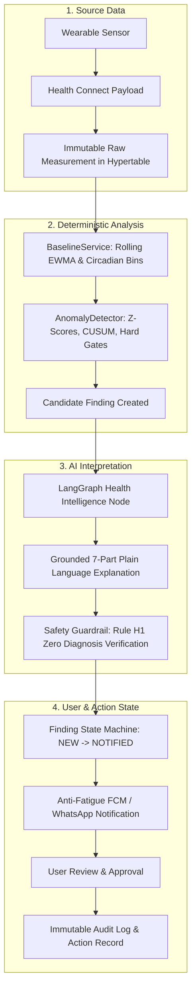
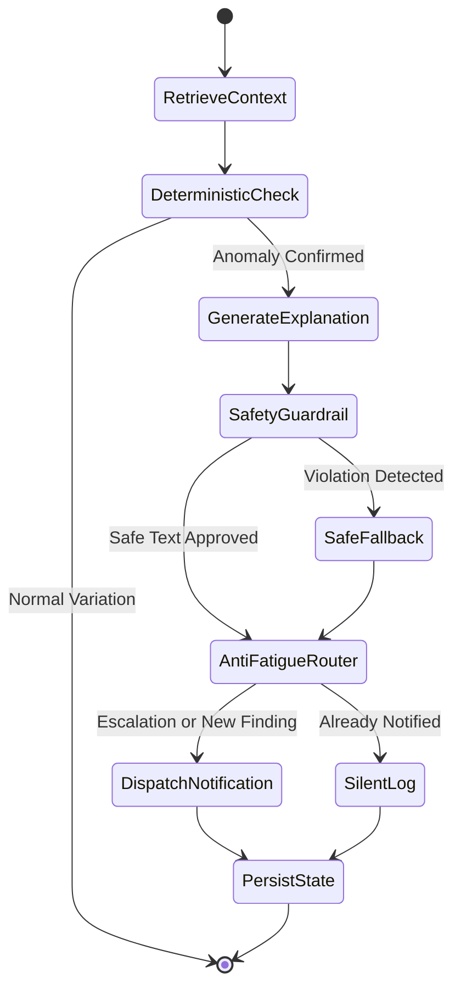

# Architecture.md — Technical Architecture Specification

This document defines the complete system architecture, component boundaries, data processing pipelines, and agent orchestration for Personal Health OS.

---

## 1. System Topology & Component Overview

```
 ┌────────────────────────────────────────────────────────┐
 │                      SENSOR LAYER                      │
 │    Wear OS Watch (Sensors) │ Samsung Galaxy Watch      │
 └────────────────────────────┬───────────────────────────┘
                              │ Android Health Connect (On-Device IPC)
                              ▼
 ┌────────────────────────────────────────────────────────┐
 │              ANDROID CLIENT DATA GATEWAY               │
 │  - HealthConnectManager.kt    - Room DB Offline Queue  │
 │  - WorkManager SyncWorker     - FCM Notification UI    │
 │  - Biometric Auth Lock        - Daily PDF Viewer       │
 └────────────────────────────┬───────────────────────────┘
                              │ HTTPS (TLS 1.3 + JWT Bearer)
                              ▼
 ┌────────────────────────────────────────────────────────┐
 │                 FASTAPI BACKEND GATEWAY                │
 │  - /v1/sync/batch (Idempotent Ingestion)               │
 │  - /v1/measurements, /v1/findings, /v1/reports         │
 │  - Pydantic v2 Request/Response Validation             │
 │  - Dependency Injection (Scoped DB Session, Redis)     │
 └────────────────────────────┬───────────────────────────┘
                              │
          ┌───────────────────┴───────────────────┐
          ▼                                       ▼
 ┌─────────────────────────────┐         ┌─────────────────────────────┐
 │    POSTGRESQL 16 + TIMESCALE│         │        REDIS 7 + ARQ        │
 │  - measurements (Hypertable)│         │  - ARQ Background Queue     │
 │  - baselines, findings      │         │  - Cadence Scheduler        │
 │  - user_approvals, audit_log│         │  - User Baseline Cache      │
 └─────────────┬───────────────┘         └──────────────┬──────────────┘
               │                                        │
               └───────────────────┬────────────────────┘
                                   │ Dispatched Background Task
                                   ▼
 ┌────────────────────────────────────────────────────────┐
 │         DETERMINISTIC ANALYTICS (NUMPY/SCIPY)          │
 │  - BaselineService: Rolling 30-Day Mean, Stddev, EWMA  │
 │  - AnomalyDetector: Z-Score & CUSUM Deviation Engine   │
 │  - Biological Hard Gates: Severe Tachy/Bradycardia     │
 └────────────────────────────┬───────────────────────────┘
                              │ Candidate Findings
                              ▼
 ┌────────────────────────────────────────────────────────┐
 │             LANGGRAPH AGENT ORCHESTRATION              │
 │  - Health Intelligence Graph (7-Part Plain Language)   │
 │  - Safety Guardrail Node (Zero Diagnosis Rule H1)      │
 │  - Notification Router Graph (Anti-Fatigue Logic)      │
 │  - Daily Report Graph (Digest & Stoic Quote)           │
 │  - Care Navigation Graph (Provider Research & Summary) │
 └────────────────────────────┬───────────────────────────┘
                              │ Tracing & Evals
                              ▼
 ┌────────────────────────────────────────────────────────┐
 │             LANGSMITH OBSERVABILITY TIER               │
 │  - Run Tracing, Latency Profiling, Token Tracking      │
 │  - Automated Dataset Evaluation & Prompt Versioning    │
 └────────────────────────────┬───────────────────────────┘
                              │ Alerts & Artifacts
                              ▼
 ┌────────────────────────────────────────────────────────┐
 │               DELIVERY & ACTION GATEWAYS               │
 │  - Firebase Cloud Messaging (FCM Push — MVP)           │
 │  - WhatsApp Business Cloud API (V1 Alert Channel)      │
 │  - ReportLab PDF Compiler (Daily Health Digest)        │
 │  - Doctor Visit Summary Generator (Care Navigation)    │
 └────────────────────────────────────────────────────────┘
```

---

## 2. The Four Layers of Truth

Personal Health OS strictly segregates and preserves the four layers of truth across the entire lifecycle:



1. **Source Data:** What the device physically recorded. Preserved immutably in the `measurements` hypertable with original value, original unit, device ID, source timestamp, and data quality flag.
2. **Deterministic Analysis:** What our Python statistical code calculated. Rolling 30-day baseline statistics, circadian hour profiles, and z-score mathematical deviations. An LLM is never permitted to calculate or guess these metrics.
3. **AI Interpretation:** What an agent inferred from the analytical results. Grounded strictly in the deterministic data without adding unmeasured assumptions. Structured into the mandatory 7-part explanation and passed through safety guardrails.
4. **User & Action State:** What the user approved and what actions were taken. Recorded in `user_approvals`, `appointment_requests`, and `audit_logs`. No consequential action occurs without an explicit user authorization token.

---

## 3. Ingestion & Data Pipeline

```
[INGEST] 
  └── Android WorkManager pushes batch to POST /v1/sync/batch with Idempotency-Key
[VALIDATE] 
  └── Pydantic v2 validates physiological limits, timestamps, and schema structure
[NORMALIZE] 
  └── Standardize units (bpm, steps, meters, celsius) and align timestamps to UTC
[DEDUPLICATE] 
  └── PostgreSQL ON CONFLICT (user_id, source_id, metric_type, recorded_at) DO NOTHING
[STORE RAW PROVENANCE] 
  └── Write to TimescaleDB hypertable chunk (7-day time partitions)
[AGGREGATE] 
  └── Compute hourly rollups and 24-hour summary tables in background
[CALCULATE BASELINE] 
  └── Recompute rolling 30-day mean, standard deviation, and circadian curves daily
[ANALYZE] 
  └── AnomalyDetector evaluates z-score against circadian hour and historical CUSUM
[CREATE ANOMALY CANDIDATE] 
  └── If Z >= 2.8 or hard gate breached, insert Finding entity with status 'new'
[AGENT INTERPRETATION] 
  └── LangGraph Health Intelligence Graph synthesizes grounded 7-part explanation
[SAFETY CHECK] 
  └── Safety Guardrail node inspects text for prohibited diagnoses (Rule H1)
[ACTION] 
  └── Notification Graph routes to FCM / WhatsApp respecting anti-fatigue state
[AUDIT] 
  └── Record state transition, agent run ID, and delivery result in audit_logs
```

---

## 4. FastAPI Service Architecture

The backend is built with FastAPI 0.111+ using asynchronous I/O and dependency injection:

- **Router Layer (`app/api/v1/endpoints/`):** Thin controller endpoints that validate request bodies via Pydantic schemas, extract authenticated user credentials via `Depends(get_current_user)`, and delegate business logic directly to domain services or enqueue ARQ worker tasks.
- **Service Layer (`app/services/`):** Pure Python business logic classes containing database operations, unit conversions, and analytical algorithms.
- **Repository Layer (`app/repositories/`):** Data access abstractions executing async SQLAlchemy 2.0 queries over PostgreSQL.
- **Error Handling (`app/core/exceptions.py`):** Global exception handlers intercepting validation, authorization, and domain errors to produce RFC 7807 Problem Details JSON.

---

## 5. PostgreSQL 16 & TimescaleDB Architecture

- **TimescaleDB Hypertables:** The `measurements` table is configured as a TimescaleDB hypertable partitioned by 7-day intervals on `recorded_at`. This provides fast append throughput and sub-millisecond range queries across millions of biometric data points.
- **Relational Integrity:** Core entities (`users`, `devices`, `wearable_sources`, `baselines`, `findings`, `reports`, `user_approvals`, `audit_logs`) use standard foreign keys with `ON DELETE CASCADE` or `SET NULL`.
- **Deduplication Constraints:** A composite unique index on `(user_id, source_id, metric_type, recorded_at)` prevents duplicated data points during network retries.

---

## 6. Redis 7 & ARQ Background Worker Architecture

Background and long-running operations are completely decoupled from HTTP request cycles using ARQ and Redis:

- **Worker Configuration:** ARQ workers run in dedicated processes, sharing the same async database engine and Pydantic schemas as FastAPI.
- **Task Types:**
  - `job_evaluate_acute_ingest`: Triggered immediately when incoming batch contains readings breaching hard physiological boundaries.
  - `cron_hourly_trend_rollup`: Scheduled at minute 0 of every hour to compute micro-trends and evaluate Level 2 (Attention) findings.
  - `cron_daily_baseline_recompute`: Scheduled at 00:05 UTC to update 30-day rolling baselines.
  - `cron_daily_report_pipeline`: Scheduled at 23:50 local user time to synthesize daily narratives, generate stoic quotes, compile ReportLab vector PDFs, and notify the user.

---

## 7. LangGraph Agent Workflows

Agents operate as stateful LangGraph `StateGraph` workflows with typed state dictionaries:



### Key LangGraph Capabilities Leveraged:
1. **Typed State:** All state is declared using `TypedDict` or Pydantic models (`HealthIntelState`, `CareNavState`, `DailyReportState`).
2. **Conditional Routing:** Edge logic routes findings through safety fallbacks or suppresses notifications based on the finding state machine.
3. **Human-in-the-Loop Interruption:** The `CareNavigationGraph` and `AppointmentGraph` utilize LangGraph's `interrupt()` primitive to pause execution until the user explicitly selects a provider and authorizes outreach in the Android app.
4. **Checkpoint Persistence:** Graph execution states are durably stored in PostgreSQL using `AsyncPostgresSaver`, allowing multi-day resumption of care navigation workflows.

---

## 8. LangSmith Observability & Evaluation

Every LangGraph workflow automatically streams telemetry to LangSmith:
- **Traces:** Every node transition, LLM call, token consumption, and latency metric is recorded.
- **Run Metadata:** Tagged with `graph_name`, `user_id_hash`, `severity_tier`, `model_version`, and `prompt_version`.
- **Evaluation Benchmarks:** Automated CI test suites run evaluation datasets against LangSmith to verify:
  - 100% adherence to the mandatory 7-part explanation schema.
  - 0% occurrence of medical diagnostic terms (Rule H1).
  - 100% mathematical grounding of cited vitals against input telemetry.

---

## 9. Android Gateway & Offline Synchronization

- **Health Connect Integration:** Native Kotlin client utilizes Google's `androidx.health.connect.client` to read authorized data from Wear OS and Samsung Galaxy Watch companion apps.
- **Offline-First Staging:** Measurements are immediately written to an on-device Room database table (`offline_measurements`) with `syncStatus = PENDING`.
- **WorkManager Sync Worker:** Background synchronization runs periodically with network connectivity and battery constraints. Failed requests retry with exponential backoff.
- **Zero Client Reasoning:** The Android app performs zero clinical or statistical reasoning; it serves strictly as a data gateway, notification viewer, and PDF reader.

---

## 10. External Integration Boundaries

All third-party services are wrapped behind Python abstract base classes:
- `DataSourceAdapter`: Standard interface for Health Connect, Fitbit Web API, and Garmin Health API.
- `NotificationChannel`: Standard interface for FCM Push Dispatcher and WhatsApp Cloud API Adapter.
- `HealthcareDirectoryProvider`: Standard interface for Google Places API and OpenStreetMap clinic lookups.
- **Hard Rule:** Third-party integrations must never leak vendor-specific models into the core domain or database schema.
