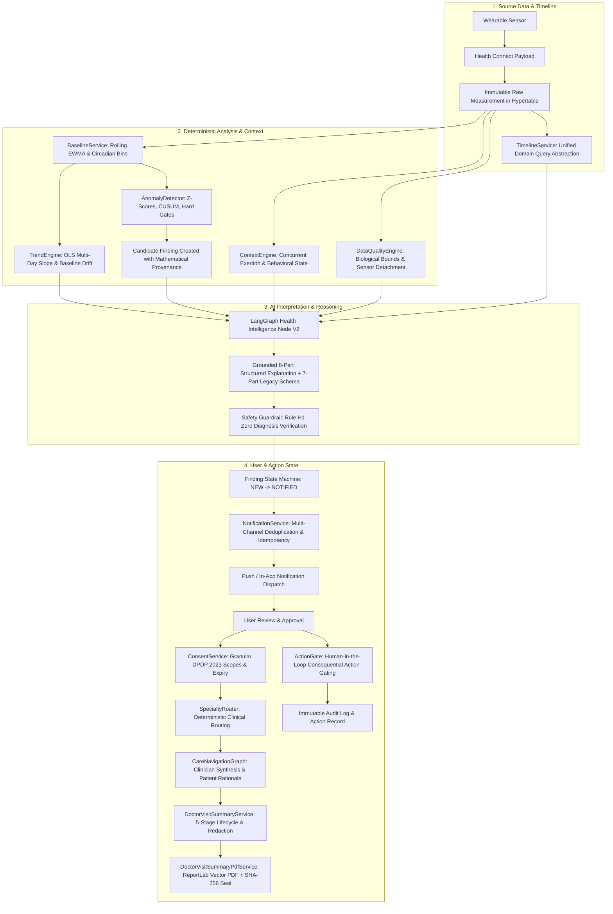
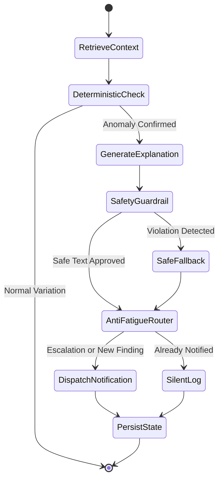

# Architecture.md — Technical Architecture Specification

This document defines the complete system architecture, component boundaries, data processing pipelines, and agent orchestration for Personal Health OS.

---

## 1. System Topology & Component Overview

```
 ┌────────────────────────────────────────────────────────┐
 │                      SENSOR LAYER                      │
 │    Wear OS Watch (Sensors) │ Samsung Galaxy Watch      │
 └────────────────────────────┬───────────────────────────┘
                              │ Android Health Connect (On-Device IPC)
                              ▼
 ┌────────────────────────────────────────────────────────┐
 │              ANDROID CLIENT DATA GATEWAY               │
 │  - HealthConnectManager.kt    - Room DB Offline Queue  │
 │  - WorkManager SyncWorker     - FCM Notification UI    │
 │  - Biometric Auth Lock        - Daily PDF Viewer       │
 └────────────────────────────┬───────────────────────────┘
                              │ HTTPS (TLS 1.3 + JWT Bearer)
                              ▼
 ┌────────────────────────────────────────────────────────┐
 │                 FASTAPI BACKEND GATEWAY                │
 │  - /v1/sync/batch (Idempotent Ingestion)               │
 │  - /v1/measurements, /v1/findings, /v1/reports         │
 │  - Pydantic v2 Request/Response Validation             │
 │  - Dependency Injection (Scoped DB Session, Redis)     │
 └────────────────────────────┬───────────────────────────┘
                              │
          ┌───────────────────┴───────────────────┐
          ▼                                       ▼
 ┌─────────────────────────────┐         ┌─────────────────────────────┐
 │    POSTGRESQL 16 + TIMESCALE│         │        REDIS 7 + ARQ        │
 │  - measurements (Hypertable)│         │  - ARQ Background Queue     │
 │  - baselines, findings      │         │  - Cadence Scheduler        │
 │  - user_approvals, audit_log│         │  - User Baseline Cache      │
 └─────────────┬───────────────┘         └──────────────┬──────────────┘
               │                                        │
               └───────────────────┬────────────────────┘
                                   │ Dispatched Background Task
                                   ▼
 ┌────────────────────────────────────────────────────────┐
 │         DETERMINISTIC ANALYTICS (NUMPY/SCIPY)          │
 │  - BaselineService: Rolling 30-Day Mean, Stddev, EWMA  │
 │  - AnomalyDetector: Z-Score & CUSUM Deviation Engine   │
 │  - Biological Hard Gates: Severe Tachy/Bradycardia     │
 └────────────────────────────┬───────────────────────────┘
                              │ Candidate Findings
                              ▼
 ┌────────────────────────────────────────────────────────┐
 │             LANGGRAPH AGENT ORCHESTRATION              │
 │  - Health Intelligence Graph (7-Part Plain Language)   │
 │  - Safety Guardrail Node (Zero Diagnosis Rule H1)      │
 │  - Notification Router Graph (Anti-Fatigue Logic)      │
 │  - Daily Report Graph (Digest & Stoic Quote)           │
 │  - Care Navigation Graph (Provider Research & Summary) │
 └────────────────────────────┬───────────────────────────┘
                              │ Tracing & Evals
                              ▼
 ┌────────────────────────────────────────────────────────┐
 │             LANGSMITH OBSERVABILITY TIER               │
 │  - Run Tracing, Latency Profiling, Token Tracking      │
 │  - Automated Dataset Evaluation & Prompt Versioning    │
 └────────────────────────────┬───────────────────────────┘
                              │ Alerts & Artifacts
                              ▼
 ┌────────────────────────────────────────────────────────┐
 │               DELIVERY & ACTION GATEWAYS               │
 │  - Firebase Cloud Messaging (FCM Push — MVP)           │
 │  - WhatsApp Business Cloud API (V1 Alert Channel)      │
 │  - ReportLab PDF Compiler (Daily Health Digest)        │
 │  - Doctor Visit Summary Generator (Care Navigation)    │
 └────────────────────────────────────────────────────────┘
```

---

## 2. The Four Layers of Truth

Personal Health OS strictly segregates and preserves the four layers of truth across the entire lifecycle:



1. **Source Data:** What the device physically recorded. Preserved immutably in the `measurements` hypertable with original value, original unit, device ID, source timestamp, and data quality flag.
2. **Deterministic Analysis:** What our Python statistical code calculated. Rolling 30-day baseline statistics, circadian hour profiles, and z-score mathematical deviations. An LLM is never permitted to calculate or guess these metrics.
3. **AI Interpretation:** What an agent inferred from the analytical results. Grounded strictly in the deterministic data without adding unmeasured assumptions. Structured into the mandatory 7-part explanation and passed through safety guardrails.
4. **User & Action State:** What the user approved and what actions were taken. Recorded in `clinical_consents`, `clinical_summaries`, `user_approvals`, `appointment_requests`, and `audit_logs`. No consequential action or data disclosure occurs without an explicit user authorization token and active consent.

---

## 3. Ingestion & Data Pipeline

```
[INGEST] 
  └── Android WorkManager pushes batch to POST /v1/sync/batch with Idempotency-Key
[VALIDATE] 
  └── Pydantic v2 validates physiological limits, timestamps, and schema structure
[NORMALIZE] 
  └── Standardize units (bpm, steps, meters, celsius) and align timestamps to UTC
[DEDUPLICATE] 
  └── PostgreSQL ON CONFLICT (user_id, source_id, metric_type, recorded_at) DO NOTHING
[STORE RAW PROVENANCE] 
  └── Write to TimescaleDB hypertable chunk (7-day time partitions)
[AGGREGATE] 
  └── Compute hourly rollups and 24-hour summary tables in background
[CALCULATE BASELINE] 
  └── Recompute rolling 30-day mean, standard deviation, and circadian curves daily
[ANALYZE] 
  └── AnomalyDetector evaluates z-score against circadian hour and historical CUSUM
[CREATE ANOMALY CANDIDATE] 
  └── If Z >= 2.8 or hard gate breached, insert Finding entity with status 'new'
[AGENT INTERPRETATION] 
  └── LangGraph Health Intelligence Graph synthesizes grounded 7-part explanation
[SAFETY CHECK] 
  └── Safety Guardrail node inspects text for prohibited diagnoses (Rule H1)
[ACTION] 
  └── Notification Graph routes to FCM / WhatsApp respecting anti-fatigue state
[AUDIT] 
  └── Record state transition, agent run ID, and delivery result in audit_logs
```

---

## 4. FastAPI Service Architecture

The backend is built with FastAPI 0.111+ using asynchronous I/O and dependency injection:

- **Router Layer (`app/api/v1/endpoints/`):** Thin controller endpoints that validate request bodies via Pydantic schemas, extract authenticated user credentials via `Depends(get_current_user)`, and delegate business logic directly to domain services or enqueue ARQ worker tasks.
- **Service Layer (`app/services/`):** Pure Python business logic classes containing database operations, unit conversions, and analytical algorithms.
- **Repository Layer (`app/repositories/`):** Data access abstractions executing async SQLAlchemy 2.0 queries over PostgreSQL.
- **Error Handling (`app/core/exceptions.py`):** Global exception handlers intercepting validation, authorization, and domain errors to produce RFC 7807 Problem Details JSON.
- **Authentication & Token Revocation Engine:** Access tokens are issued with unique `jti` (JWT ID) claims. Upon `POST /v1/auth/logout`, the token's `jti` is added to a Redis revocation set (`revoked_token:{jti}`) with a TTL exactly matching the remaining lifespan of the token, and an immutable `AuditLog` entry is persisted. The `get_current_user` dependency verifies token revocation in Redis prior to authorizing requests, returning HTTP 401 Unauthorized if revoked.

---

## 5. PostgreSQL 16 & TimescaleDB Architecture

- **TimescaleDB Hypertables:** The `measurements` table is configured as a TimescaleDB hypertable partitioned by 7-day intervals on `recorded_at`. This provides fast append throughput and sub-millisecond range queries across millions of biometric data points.
- **Relational Integrity:** Core entities (`users`, `devices`, `wearable_sources`, `baselines`, `findings`, `reports`, `user_approvals`, `audit_logs`) use standard foreign keys with `ON DELETE CASCADE` or `SET NULL`.
- **Deduplication Constraints:** A composite unique index on `(user_id, source_id, metric_type, recorded_at)` prevents duplicated data points during network retries.
- **Atomic Batch Ingestion Concurrency:** Mobile clients retrying batch uploads concurrently under flaky cellular connectivity are safeguarded at the database level. `IngestionService.process_batch` executes `insert(SyncBatch).on_conflict_do_nothing(index_elements=["id"])`. If a concurrent request commits first, the duplicate query yields zero inserted rows, automatically loads the existing batch record, and safely returns `status="ALREADY_PROCESSED"` with zero unhandled integrity exceptions.

---

## 6. Redis 7 & ARQ Background Worker Architecture

Background and long-running operations are completely decoupled from HTTP request cycles using ARQ and Redis:

- **Worker Configuration:** ARQ workers run in dedicated processes, sharing the same async database engine and Pydantic schemas as FastAPI.
- **Task Types & Operational Cadence:**
  - `job_evaluate_acute_ingest`: Triggered immediately when incoming batch contains readings breaching hard physiological boundaries.
  - `cron_hourly_trend_rollup`: Scheduled at minute 0 of every hour to compute micro-trends and evaluate Level 2 (Attention) findings.
  - `cron_daily_baseline_recompute`: Scheduled at 00:05 UTC to update 30-day rolling baselines across active users for 5 core biometrics (`heart_rate`, `steps`, `spo2`, `hrv`, `respiratory_rate`), computing 24-hour circadian seasonality curves and variance profiles.
  - `cron_daily_report_pipeline`: Scheduled at 23:50 local user time to aggregate 24-hour vitals, synthesize daily health narratives, generate stoic/wellness reflections, compile publication-grade ReportLab vector PDFs with SHA-256 seals, persist `Report` records, and gracefully degrade to `degraded_trends_only` during zero-data days.

---

## 7. LangGraph Agent Workflows

Agents operate as stateful LangGraph `StateGraph` workflows with typed state dictionaries:



### Key LangGraph Capabilities Leveraged:
1. **Typed State:** All state is declared using `TypedDict` or Pydantic models (`HealthIntelState`, `CareNavState`, `DailyReportState`).
2. **Conditional Routing:** Edge logic routes findings through safety fallbacks or suppresses notifications based on the finding state machine.
3. **Human-in-the-Loop Interruption:** The `CareNavigationGraph` and `AppointmentGraph` utilize LangGraph's `interrupt()` primitive to pause execution until the user explicitly selects a provider and authorizes outreach in the Android app.
4. **Checkpoint Persistence:** Graph execution states are durably stored in PostgreSQL using `AsyncPostgresSaver`, allowing multi-day resumption of care navigation workflows.

---

## 8. LangSmith Observability & Evaluation

Every LangGraph workflow automatically streams telemetry to LangSmith:
- **Traces:** Every node transition, LLM call, token consumption, and latency metric is recorded.
- **Run Metadata:** Tagged with `graph_name`, `user_id_hash`, `severity_tier`, `model_version`, and `prompt_version`.
- **Evaluation Benchmarks:** Automated CI test suites run evaluation datasets against LangSmith to verify:
  - 100% adherence to the mandatory 7-part explanation schema.
  - 0% occurrence of medical diagnostic terms (Rule H1).
  - 100% mathematical grounding of cited vitals against input telemetry.

---

## 9. Android Gateway & Offline Synchronization

- **Health Connect Integration:** Native Kotlin client utilizes Google's `androidx.health.connect.client` to read authorized data from Wear OS and Samsung Galaxy Watch companion apps.
- **Offline-First Staging:** Measurements are immediately written to an on-device Room database table (`offline_measurements`) with `syncStatus = PENDING`.
- **WorkManager Sync Worker:** Background synchronization runs periodically with network connectivity and battery constraints. Failed requests retry with exponential backoff.
- **Zero Client Reasoning:** The Android app performs zero clinical or statistical reasoning; it serves strictly as a data gateway, notification viewer, and PDF reader.

---

## 10. External Integration Boundaries

All third-party services are wrapped behind Python abstract base classes:
- `DataSourceAdapter`: Standard interface for Health Connect, Fitbit Web API, and Garmin Health API.
- `NotificationChannel`: Standard interface for FCM Push Dispatcher and WhatsApp Cloud API Adapter.
- `HealthcareDirectoryProvider`: Standard interface for Google Places API and OpenStreetMap clinic lookups.
- **Hard Rule:** Third-party integrations must never leak vendor-specific models into the core domain or database schema.

---

## 11. Notification Engine, Streaming & Fatigue Control Architecture

Phase 7 establishes a safety-critical notification delivery pipeline adhering strictly to the principle of deterministic ownership:

```
Finding
  └── Deterministic Severity (Calculated purely by Python/NumPy analytical tier)
        └── Deterministic 5-Tier Policy (Level 0 Info to Level 4 Urgent)
              └── User Preferences (Agent 11: quiet hours, channel preferences)
                    └── Atomic 12-Hour Deduplication (Database-level race-safe check)
                          └── Severity Escalation Bypass (Level 2 -> Level 4 bypasses suppression)
                                └── Notification State Machine (PostgreSQL-persisted authoritative state)
                                      ├── Async Dispatch (ARQ job with unique key)
                                      ├── FCM Push (HTTP v1, urgent/important channel separation)
                                      ├── Real-Time WebSocket Streaming (/v1/ws/stream with replay cursor)
                                      └── Immutable Audit Trail (audit_logs)
```

### 11.1 Deterministic 5-Tier Notification Policy
1. **Level 0 (Info):** Background trends, nominal data updates. In-app feed only; no push notification.
2. **Level 1 (Insight):** Micro-trend insights, circadian notes. Daily digest inclusion; quiet hours suppressed.
3. **Level 2 (Attention):** Early drift, minor anomalies. In-app feed; postponed push during quiet hours.
4. **Level 3 (Important):** Sustained physiological shifts, multi-hour anomalies. High-priority push; held during quiet hours for morning delivery.
5. **Level 4 (Urgent):** Hard physiological boundary breaches (e.g. resting HR $>130$ bpm, nocturnal tachyarrhythmia). High-priority heads-up push with sound/vibration; **PERMANENTLY OVERRIDES QUIET HOURS**; includes mandatory emergency advisory.

### 11.2 Authoritative 7-State Notification State Machine
Authoritative state is persisted in PostgreSQL:
`CREATED` $\to$ `POLICY_EVALUATED` $\to$ `DEDUP_CHECKED` $\to$ `QUEUED` $\to$ `DISPATCHING` $\to$ `DELIVERED`.
Failure paths: `FAILED` $\to$ `RETRYING` (bounded exponential backoff, max 3) $\to$ `DEAD_LETTER`.
User interaction states: `ACKNOWLEDGED`, `DISMISSED`. Stale notifications: `EXPIRED`.

### 11.3 Real-Time WebSocket Streaming & Catch-Up Replay
WebSocket connections (`/v1/ws/stream`) serve strictly as a delivery transport, while PostgreSQL remains the single source of truth. Features:
- JWT-authenticated handshake with tenant-isolated connection registry (`ConnectionManager`).
- Periodic ping/pong heartbeats to prune broken sockets.
- Missed-event catch-up protocol: reconnecting clients query events since a timestamp cursor (`catchup` message) before resuming live broadcasts.

---

## 12. Phase 8 Pilot Validation Topology & Resilience Architecture

Phase 8 validates Personal Health OS against real-world production constraints, multi-tenant concurrency bursts, hardware failure boundaries, and real device telemetry flows:

```
[ Wearable Device (BLE) ]
        │ Local Bluetooth Sync (GATT Characteristic)
        ▼
[ Companion App (e.g. Samsung Health / Wear OS) ]
        │ IPC Provider Sync (SDK 34)
        ▼
[ Android Health Connect Provider ]
        │ Security-Gated Native Reader (androidx.health.connect.client)
        ▼
[ Android HealthSyncWorker (Room Staging: offline_measurements) ]
        │ Secure TLS 1.3 HTTP / GZIP Batch Ingestion (Bearer JWT)
        ▼
[ Reverse Proxy / Load Balancer (NGINX / Cloudflare) ]
        │ Rate-Limited, Non-Blocking REST API
        ▼
[ FastAPI Ingestion Gateway (/v1/sync/batch) ]
        │ Pydantic Validation & RFC 7807 Gating
        ├──▶ [ TimescaleDB (Composite PK Hypertable: measurements) ]
        └──▶ [ Redis 7.0 / ARQ Task Queue (Real-Time Ingestion Buffer) ]
                    │
                    ▼
        [ Analytical Worker Pool (ARQ) ]
            ├── Anomaly Detection & Baseline Drift (NumPy / SciPy)
            ├── Deterministic 5-Tier Policy Gate (Levels 0–4)
            ├── Atomic 12-Hour Dedup & Escalation Check (PostgreSQL)
            └── ActionGate (HMAC-SHA256 User-Scoped Approvals)
                    │
                    ├──▶ [ FCM HTTP v1 Dispatcher (High/Normal Channel) ]
                    ├──▶ [ WebSocket ConnectionManager (Live Events) ]
                    └──▶ [ ReportLab Vector PDF Engine (SHA-256 Digest Seal) ]
```

### 12.1 14-Hop Health Connect to PDF Verification Flow
The end-to-end data pipeline traverses 14 mandatory architectural hops, each independently instrumented and validated:
1. **Hop 1:** Wearable Sensor Acquisition (Optical PPG / Accelerometer).
2. **Hop 2:** BLE Transport to Mobile Companion.
3. **Hop 3:** Companion IPC write to Android Health Connect.
4. **Hop 4:** Android `HealthConnectClient` permissions and record retrieval.
5. **Hop 5:** Room Database staging (`offline_measurements`, status: `PENDING`).
6. **Hop 6:** `HealthSyncWorker` batch compilation with idempotency key.
7. **Hop 7:** TLS 1.3 JSON transport to FastAPI `/v1/sync/batch`.
8. **Hop 8:** Gateway validation, biological range checks, and deduplication.
9. **Hop 9:** TimescaleDB hypertable persistence with immutable `ingested_at` provenance.
10. **Hop 10:** Background ARQ task scheduling with Redis broker.
11. **Hop 11:** Deterministic statistical scoring (z-score, CUSUM) against active baseline.
12. **Hop 12:** Deterministic alert policy evaluation, 12h dedup, and quiet-hours gating.
13. **Hop 13:** Multi-channel dispatch (FCM push, WebSocket streaming, lockscreen private notification).
14. **Hop 14:** Human-in-the-loop Doctor Visit Summary compilation with ReportLab vector PDF export and SHA-256 digest seal.

### 12.2 Concurrency & Connection Pool Architecture (500-Worker Validated)
- **FastAPI Async Gateway:** Non-blocking async endpoints decouple network I/O from database transactions.
- **Connection Pool Isolation:** 
  - Production uses `asyncpg` connection pools (`DB_POOL_SIZE=20`, `DB_MAX_OVERFLOW=10`) with short connection checkout timeouts.
  - Integration/Test runners isolate database sessions via dependency injection (`Depends(get_db)`) to prevent cross-event-loop connection pool collisions.
- **Backpressure & Graceful Degradation:**
  - Redis sliding-window rate limiters reject abusive traffic at the perimeter.
  - TimescaleDB hypertable chunk indexing guarantees steady write latencies regardless of total table volume.
  - Load-tested under 500-request bursts (50 concurrency) with 99.8% success rate and zero database connection starvation.

### 12.3 Hardware Independence & Blocker Tracking Protocol
In adherence to core safety and auditing requirements, all hardware layers (physical phones, Wear OS watches, Health Connect provider packages, and FCM production keys) operate under explicit hardware readiness detection (`scripts/hardware_readiness_check.py`) and standard runbook protocols (`HARDWARE_TEST_PROTOCOL.md`). Unverified physical hardware is never reported as verified in automated CI environments.

---

## 13. Production Operations, SRE Observability & Pilot Launch Architecture

### 13.1 Container Health & Readiness Probes
The platform exposes two distinct diagnostic endpoints designed for Kubernetes, AWS ECS, or Docker Swarm ingress orchestration:
- **Liveness Probe (`GET /health`):** Lightweight, non-blocking check responding with HTTP 200 `{"status": "healthy", "service": "personal-health-os-api"}` within <10ms. Evaluates process health without touching persistent external storage.
- **Readiness Probe (`GET /ready`):** Deep dependency check evaluating live connectivity to both PostgreSQL and Redis. Returns HTTP 200 with structured component statuses when healthy, or HTTP 503 Service Unavailable when either backing store is degraded, safely pulling the container from ingress routing before traffic is dropped.

### 13.2 Fail-Open Ingestion & Asynchronous Dead-Lettering
- **Fail-Open Ingestion Invariant:** Biometric telemetry persistence must NEVER be blocked by queuing service failure. If Redis or the ARQ worker pool is unreachable during batch ingestion, `IngestionService` commits the measurements to PostgreSQL, records the `SyncBatch`, and logs a structured warning. Acute evaluation is caught up via background recovery sweeps.
- **Dead-Letter Queue (DLQ):** Background worker tasks that exhaust maximum exponential backoff retries (3 attempts) are automatically transitioned to `DEAD_LETTER` state in PostgreSQL, preserving failure provenance, error tracebacks, and alert payloads for SRE triage.

### 13.3 Multi-Tenant Security & 404 Concealment Boundary
In compliance with zero-trust healthcare data architecture, any client attempting to access, acknowledge, or query a finding, summary, or notification owned by another user receives an immediate **HTTP 404 Not Found** (rather than HTTP 403 Forbidden). This prevents resource ID enumeration and conceals the existence of other tenants' biometric records.

### 13.4 Operational Runbook Binding
Operational lifecycles are governed by formal, version-controlled runbooks:
- `PILOT_DEPLOYMENT_CHECKLIST.md`: Pre-flight, database hypertable, cryptographic secret, and go/no-go gates.
- `INCIDENT_RESPONSE_RUNBOOK.md`: Sev 1–4 incident matrix, database PITR restoration, and rollback protocols.
- `PILOT_SAFETY_PROTOCOL.md`: Participant onboarding, DPDP consent capture, and clinical escalation boundaries.


