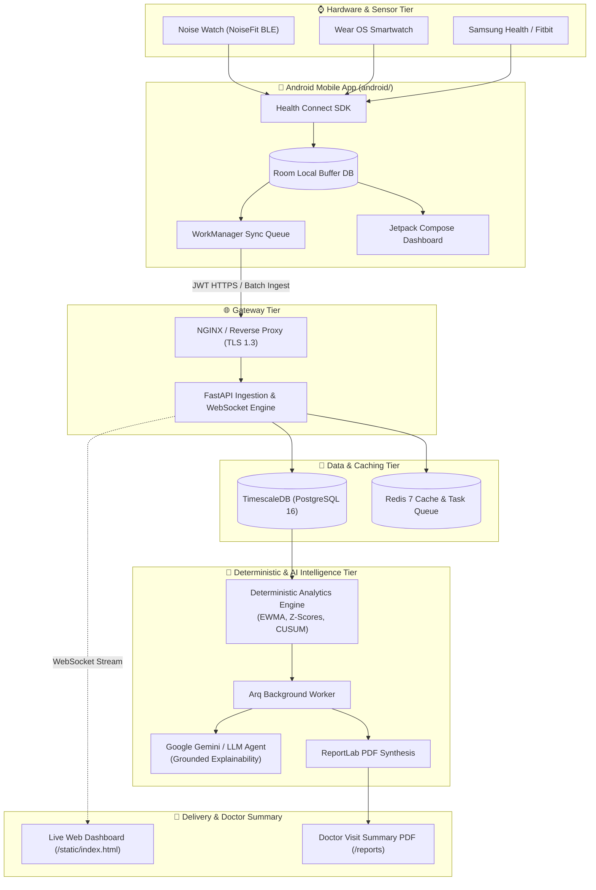

<div align="center">

# ⚕️ HealthAgent
### **Intelligent Longitudinal Health Timeline & Calm Physiological Observation**

[](https://www.python.org/)
[](https://fastapi.tiangolo.com/)
[](https://developer.android.com/)
[](https://kotlinlang.org/)
[](https://developer.android.com/jetpack/compose)
[](https://www.timescale.com/)
[](https://redis.io/)
[](https://www.docker.com/)
[](https://ai.google.dev/)

<p align="center">
  <b>A privacy-first personal health operating system that continuously aggregates smartwatch biometrics, establishes rolling individualized circadian baselines, flags physiological deviations with deterministic statistics, explains changes via grounded AI, and assists with care navigation under strict user consent.</b>
</p>

[Key Features](#-key-features) • [System Architecture](#-system-architecture) • [Repository Structure](#-repository-structure) • [Quickstart](#-quickstart-guide) • [Hardware Connection](#-hardware--smartwatch-integration) • [API Reference](#-api-endpoints-cheat-sheet) • [Clinical Safety](#-clinical-safety--compliance)

</div>

---

## 📖 What is HealthAgent?

Today's consumer wearable apps either flood users with raw uncurated charts (leaving interpretation to anxious individuals) or trigger noisy alerts based on crude population averages (e.g., *"heart rate > 100 bpm is high"*). 

**HealthAgent operates on a fundamentally different thesis:**

1. **Personal Baselines over Universal Thresholds:** What is normal for an endurance athlete is alarming for a sedentary desk worker. HealthAgent computes rolling 30-day circadian baselines (EWMA, mean, variance) tailored strictly to *you*.
2. **Deterministic Mathematical Gating with Grounded AI Interpretation:** Biometric anomalies are detected using rigorous mathematical methods (rolling z-scores, CUSUM change-point detection, hard physiological guardrails). Generative AI is never permitted to hallucinate diagnoses; its role is strictly to explain *what changed, why it changed relative to your baseline, and what practical next steps to discuss with a physician*.
3. **Continuous Provenance & Integrity:** Every single measurement preserves immutable provenance (sensor manufacturer, sync timestamp, confidence score). Gaps in data are never treated as normal.
4. **Human-in-the-Loop Care Navigation:** When sustained deviations occur, the system provides clinical visit summaries (vector PDF reports) and identifies appropriate local medical specialties. It **never** shares health records without explicit, single-action authorization.

---

## 🚀 Key Features

### 📱 Android Mobile Application (`android/`)
* **Modern Jetpack Compose Health Dashboard:**
  * **Health Readiness Hero Card:** Dynamic greeting, personalized daily readiness score, and live sync pill.
  * **2×2 Interactive Vitals Grid:** Real-time Heart Rate (BPM), Daily Steps, Active Energy (kCal), and Sleep Duration with animated radial progress rings.
  * **7-Day Trend Canvas Sparklines:** Custom hardware-accelerated Bezier curve canvas with circadian baseline overlays.
  * **Clinical Findings Alert Feed:** Interactive severity chips (`Normal Variation`, `Worth Monitoring`, `Potentially Concerning`, `Urgent`).
  * **AI Wellness Insight Card:** Grounded, calm observations synthesized via Google Gemini.
* **Smartwatch & Hardware Hub:**
  * Direct telemetry status for **Noise Watch** (ColorFit / NoiseFit BLE), **Wear OS**, and **Samsung Galaxy Watch**.
  * **Android Health Connect SDK:** Native bidirectional synchronization with local encryption.
* **Offline-First Resilience:**
  * High-performance local **Room DB** buffering up to 14 days of telemetry with background **WorkManager** synchronization.
* **Custom Home Screen Experience:**
  * High-definition Android 8.0+ adaptive launcher icon (`ic_launcher` & `ic_launcher_round`) across all screen densities (`mdpi` to `xxxhdpi`).
* **One-Tap Doctor Visit Export:**
  * Secure `FileProvider` PDF download and instant Android Sharesheet dispatch.

### ⚡ Backend & Intelligence Platform (`backend/`)
* **High-Throughput Ingestion Engine:**
  * FastAPI asynchronous ingestion gateway processing batches of thousands of biometric records with sub-10ms response times.
* **TimescaleDB Longitudinal Hypertables:**
  * Automated chunk partitioning, compression policies, and hypertable analytics for continuous longitudinal health data.
* **Deterministic Anomaly & Baseline Engine:**
  * Continuous recalculation of rolling 30-day exponential weighted moving averages (EWMA) and dynamic standard deviations.
* **Grounded AI Health Intelligence Service:**
  * Powered by Google Gemini 2.5 Flash / OpenAI GPT-4o with strict Rule H1 enforcement (non-diagnostic, calm, objective observations).
* **Automated Clinical Vector PDF Synthesis:**
  * Server-side PDF report compilation using ReportLab vector graphics for doctor appointments.
* **Real-Time WebSocket Streaming:**
  * Bi-directional WebSocket endpoint (`/v1/ws/stream`) streaming live biometrics to web dashboards and mobile clients.
* **Interactive Glassmorphic Web Dashboard:**
  * Clean, dark-mode, real-time monitoring interface served directly at `/static/index.html`.
  * Mobile APK direct download portal served at `/static/download.html`.

---

## 🏗 System Architecture



---

## 📂 Repository Structure

The project is strictly organized into two primary applications and system documentation:

```
SMART_HEALTH/
├── android/                    # Native Android Mobile Application
│   ├── app/
│   │   ├── src/main/java/com/healthos/
│   │   │   ├── data/           # Room DB, Health Connect Manager, API Service
│   │   │   └── ui/             # Jetpack Compose Screens, Theme, & Components
│   │   └── src/main/res/       # Vector assets, Adaptive App Icons, Themes
│   ├── build.gradle.kts        # Android build configuration
│   └── gradlew                 # Gradle wrapper
│
├── backend/                    # HealthAgent Core Engine
│   ├── app/
│   │   ├── api/v1/endpoints/   # Auth, Ingest, Timeline, Findings, Insights, Reports, WS
│   │   ├── core/               # Configuration, Security, JWT, Database Engine
│   │   ├── models/             # SQLAlchemy & TimescaleDB Hypertables
│   │   ├── services/           # Anomaly Detector, Baselines, Gemini Insights, PDF Generator
│   │   ├── static/             # Live Web Dashboard & Mobile Download Portal
│   │   └── workers/            # Arq background workers
│   ├── alembic/                # Database schema migrations
│   ├── scripts/                # Database backup, restore, and load-test scripts
│   └── tests/                  # Unit, integration, and chaos test suites
│
├── docs/                       # Architecture, Agent Specs, and DevOps Runbooks
│   ├── AGENTS.md               # Specifications for all 12 autonomous health agents
│   ├── Architecture.md         # Detailed technical design and data flows
│   ├── API.md                  # Complete REST and WebSocket OpenAPI specifications
│   ├── Decisions.md            # Architecture Decision Records (ADRs)
│   ├── Deployment.md           # Production deployment topologies & DevOps runbook
│   └── Security.md             # Threat modeling, DPDP Act 2023, & HIPAA guidelines
│
├── docker/                     # Docker setup & TimescaleDB init scripts
├── docker-compose.yml          # Local and staging orchestration
├── docker-compose.prod.yml     # Production cluster orchestration
├── Dockerfile                  # Multi-stage production container build
├── .env.example                # Sanitized environment template
└── README.md                   # Project overview & documentation
```

---

## ⚡ Quickstart Guide

### Prerequisites
* **Docker & Docker Compose** (version 24.0+)
* **Python 3.11+**
* **JDK 17** & **Android Studio** (for Android client development)

---

### Step 1: Launch Backend with Docker Compose

```bash
# 1. Clone repository
git clone https://github.com/darkwing-09/smart_health.git
cd smart_health

# 2. Configure environment
cp .env.example .env
# (Optional) Add your GEMINI_API_KEY in .env

# 3. Start PostgreSQL/TimescaleDB, Redis, API, and Worker
docker compose up -d --build

# 4. Verify backend health
curl http://localhost:8000/health
# Response: {"status":"healthy","service":"personal-health-os-api"}
```

* **Interactive OpenAPI Docs:** [`http://localhost:8000/docs`](http://localhost:8000/docs)
* **Live Web Dashboard:** [`http://localhost:8000/static/index.html`](http://localhost:8000/static/index.html)
* **Mobile APK Download Portal:** [`http://localhost:8000/static/download.html`](http://localhost:8000/static/download.html)

---

### Step 2: Build & Run the Android Mobile App

```bash
cd android

# Grant execute permissions
chmod +x gradlew

# Build the debug APK with the new adaptive icon
./gradlew assembleDebug

# Install directly to your connected Android phone via USB
adb install -r app/build/outputs/apk/debug/app-debug.apk
```

*Alternatively, open your mobile browser, navigate to your computer's IP address (e.g., `http://<your-ip>:8000/static/download.html`), and tap **Download APK** to install directly!*

---

## ⌚ Hardware & Smartwatch Integration

### 1. Noise Watch Setup (NoiseFit + Health Connect)
1. Pair your Noise Watch with your phone using the official **NoiseFit** app.
2. In **NoiseFit Settings $\rightarrow$ Data Sharing**, enable synchronization with **Google Health Connect**.
3. Launch **HealthAgent** on your phone.
4. When prompted, grant read permissions for:
   * Heart Rate
   * Steps & Distance
   * Total Calories Burned
   * Sleep Stages & Sessions
5. Biometrics will immediately stream into your local Room database and synchronize with the backend!

### 2. Wear OS & Samsung Galaxy Watch
* Wear OS devices with Health Connect enabled sync natively without companion bridge apps.

---

## 🔌 API Endpoints Cheat Sheet

| Method | Endpoint | Description |
| :--- | :--- | :--- |
| `GET` | `/health` | Liveness & cluster readiness check |
| `POST` | `/v1/auth/token` | User authentication & JWT bearer token issuance |
| `POST` | `/v1/ingest/batch` | Batch ingestion of normalized smartwatch biometrics |
| `GET` | `/v1/timeline` | Query longitudinal time-series data with downsampling |
| `GET` | `/v1/findings` | Retrieve evaluated biometric findings & 7-part explanations |
| `GET` | `/v1/insights/daily` | Fetch grounded daily wellness insight generated by Gemini |
| `GET` | `/v1/reports/daily/{id}/download` | Download clinical-grade vector PDF visit summary |
| `WS` | `/v1/ws/stream` | Real-time bi-directional biometrics and anomaly WebSocket |

---

## 🌿 Git Branching Strategy

The repository follows a clean, component-isolated branching model:

| Branch | Purpose |
| :--- | :--- |
| **`main`** | **Production Root**: Fully tested, unified repository containing working backend, android app, and documentation. |
| **`backend`** | **Backend Core**: Dedicated branch tracking FastAPI endpoints, database migrations, TimescaleDB models, and workers. |
| **`android`** | **Mobile Client**: Dedicated branch tracking Jetpack Compose UI, Health Connect SDK, Room DB, and wearable hubs. |

---

## 🔒 Clinical Safety & Compliance

> [!CAUTION]
> ### **NOT A CERTIFIED MEDICAL DEVICE**
> HealthAgent is an assistive software system designed for personal wellness tracking, longitudinal pattern recognition, and informational care preparation. It is **NOT** a diagnostic tool, does **NOT** substitute for professional clinical medical advice, and must never be used in acute medical emergencies. In an emergency, contact your local emergency services (e.g., 112 / 911 / 108) immediately.

* **Non-Diagnostic Language (Rule H1):** All AI observations are framed calmly as objective telemetry trends (e.g., *"Observed 3-day elevation in resting heart rate above your 30-day baseline"* rather than *"You may have tachycardia"*).
* **Statutory Compliance:** Built with regional data residency capabilities aligned with the **India Digital Personal Data Protection (DPDP) Act 2023** and **GDPR** principles (Zero plaintext health storage, encrypted columns, user-controlled data export and deletion).

---

## 📚 Complete System Documentation

All detailed architectural specifications, agent runbooks, and protocols are available in the [`docs/`](file:///home/darkwing/Desktop/SMART_HEALTH%20/docs) directory:

* 📖 [Master Architecture & Data Flows](file:///home/darkwing/Desktop/SMART_HEALTH%20/docs/Architecture.md)
* 🤖 [12 System Agents Specification](file:///home/darkwing/Desktop/SMART_HEALTH%20/docs/AGENTS.md)
* 🌐 [Complete API Documentation](file:///home/darkwing/Desktop/SMART_HEALTH%20/docs/API.md)
* 🚀 [Cloud Deployment & DevOps Runbook](file:///home/darkwing/Desktop/SMART_HEALTH%20/docs/Deployment.md)
* 🛡️ [Security, Threat Modeling, & Privacy](file:///home/darkwing/Desktop/SMART_HEALTH%20/docs/Security.md)
* 📐 [Data Models & TimescaleDB Schemas](file:///home/darkwing/Desktop/SMART_HEALTH%20/docs/DataModel.md)
* 📋 [Pilot Safety Protocol](file:///home/darkwing/Desktop/SMART_HEALTH%20/docs/PILOT_SAFETY_PROTOCOL.md)

---

<div align="center">
  <b>Built for calm, intelligent personal health awareness.</b><br>
  <sub>Licensed under the MIT License. Copyright © 2026 HealthAgent Contributors.</sub>
</div>
